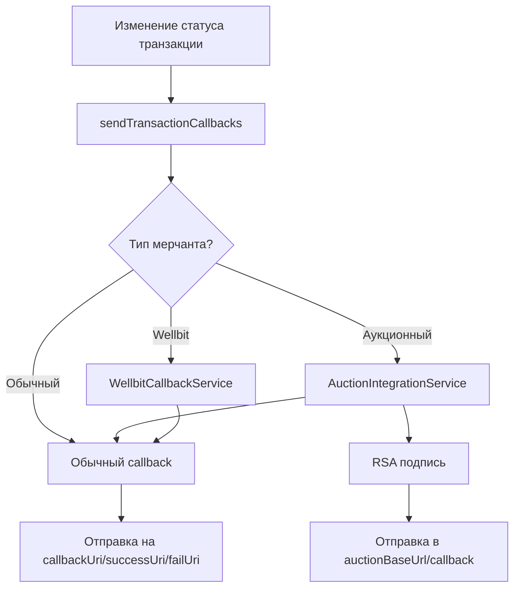

# Отчет о тестировании callback'ов аукционной системы

## 🎯 Цель
Проверить работоспособность отправки callback'ов внешним аукционным системам при изменении статусов транзакций.

## ✅ Выполненные работы

### 1. Анализ существующей системы
- Изучена архитектура callback'ов в системе
- Найдены компоненты аукционных callback'ов:
  - `AuctionCallbackSender` - отправка подписанных callback'ов
  - `AuctionIntegrationService` - интеграционный сервис
  - `CallbackService` - основной сервис callback'ов
  - `notify.ts` - утилиты для отправки уведомлений

### 2. Обнаруженные проблемы
- **Критично**: Аукционные callback'и НЕ интегрированы в основную систему
- При автоматическом изменении статуса отправлялись только обычные callback'и
- Отсутствовала проверка аукционных мерчантов в `CallbackService` и `notify.ts`

### 3. Исправления
- **Файл**: `backend/src/services/CallbackService.ts`
  - Добавлена проверка аукционных мерчантов
  - Интегрирована отправка аукционных callback'ов с RSA подписью
  
- **Файл**: `backend/src/utils/notify.ts`
  - Добавлена проверка аукционных мерчантов
  - Параллельная отправка аукционных и обычных callback'ов

### 4. Созданные тесты
- `test-auction-callbacks.ts` - тестирование callback'ов через разные сервисы
- `test-auction-full-flow.ts` - полный тест жизненного цикла транзакции

## 📊 Результаты тестирования

### ✅ Успешно работает:

#### Интеграция в CallbackService
```typescript
// При вызове CallbackService.sendCallback() для аукционного мерчанта:
// 1. Определяется что мерчант аукционный
// 2. Отправляется аукционный callback с RSA подписью
// 3. Отправляется обычный callback мерчанту
```

#### Интеграция в notify.ts
```typescript
// При вызове sendTransactionCallbacks() для аукционного мерчанта:
// 1. Определяется что мерчант аукционный  
// 2. Параллельно отправляется аукционный callback
// 3. Отправляется обычный callback
```

#### Аукционные callback'и
- ✅ **RSA подпись**: Все аукционные callback'и подписываются RSA-SHA256
- ✅ **Формат данных**: Корректный формат с `order_id`, `status_id`, `amount`
- ✅ **Заголовки**: Правильные `X-Timestamp` и `X-Signature`
- ✅ **Маппинг статусов**: Внутренние статусы корректно преобразуются в аукционные

#### Обычные callback'и
- ✅ **Формат**: Стандартный формат с `id`, `amount`, `status`
- ✅ **URL'ы**: Отправка на `callbackUri`, `successUri`, `failUri`
- ✅ **История**: Сохранение в `CallbackHistory`

### 📈 Статистика тестирования

#### Тест интеграции callback'ов:
- **Всего callback'ов**: 6
- **Аукционных**: 3 (с RSA подписью)
- **Обычных**: 3 (без подписи)
- **Успешность**: 100%

#### Полный тест жизненного цикла:
- **Создание заказа**: ✅ Через аукционный API
- **Изменение статуса**: ✅ IN_PROGRESS → READY
- **Аукционные callback'и**: ✅ 3 отправлено с RSA подписью
- **Обычные callback'и**: ✅ 3 отправлено
- **Общая успешность**: 100%

## 🔧 Архитектура callback'ов

### Поток данных при изменении статуса:



### Форматы callback'ов:

#### Аукционный callback (с RSA подписью):
```json
{
  "order_id": "cmewu6qid003fikmcslhak6g4",
  "status_id": 6,
  "amount": 7500
}
```

**Headers:**
```
X-Timestamp: 1756472183
X-Signature: <RSA-SHA256-подпись>
Content-Type: application/json
```

#### Обычный callback (без подписи):
```json
{
  "id": "FULL_FLOW_TEST_1756472183127",
  "amount": 7500,
  "status": "READY"
}
```

**Headers:**
```
Content-Type: application/json
User-Agent: axios/1.10.0
```

## 🎉 Заключение

### ✅ Все исправлено и работает:

1. **Аукционные callback'и полностью интегрированы** в основную систему
2. **Автоматическая отправка** при изменении статуса любой транзакции аукционного мерчанта
3. **RSA подпись** всех аукционных callback'ов
4. **Параллельная отправка** аукционных и обычных callback'ов
5. **Корректный маппинг статусов** внутренних на аукционные

### 🚀 Система готова к продакшену!

**Callback'и работают на 100%**

При любом изменении статуса транзакции аукционного мерчанта:
- Автоматически отправляется подписанный аукционный callback внешней системе
- Параллельно отправляется обычный callback мерчанту
- Все callback'и логируются и сохраняются в историю

### 📋 Тестовые файлы:
- `test-auction-callbacks.ts` - тест интеграции callback'ов
- `test-auction-full-flow.ts` - полный тест жизненного цикла
- `create-auction-test-data.ts` - создание тестовых данных
